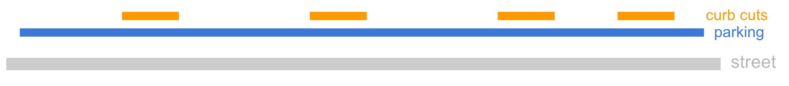

# How to survey streets with the CurbWheel

This [slide deck](https://docs.google.com/presentation/d/1NqRnIblEEMXaFtzdQwLsId2Zoh3sRvoiIRdQ_2HDb48/edit#slide=id.ga62d08dcdb_0_285) contains the most up-to-date instructions, tips, and tricks. Highlights are posted below for reference.

  

  

  

We are currently working to complete the upload notification with link.

## Tips and tricks

### Layering regulations: Efficient ways to map

Streets usually have multiple regulations along them - often with a main rule, and others layered on top. For example, this diagram shows a street that is a parking zone with frequent curb cuts.

This creates 9 different individual zones on the street. A CurbWheel user could start and stop 9 individual parking and curb cut features… or they could map the entire street as a parking zone, and layer on the curb cuts, as shown below:

The app allows you to add multiple overlapping segments on a street. The descriptive names for the features (like “Parking” or “Curb cut”) are there to help you keep track of which segment is which so you know which feature you intend to complete.

It’s often more efficient to use this layering approach to map a street.

Later on, back in the office, you will use the digitizer to define a “priority category” for each type of curb regulation. This is used in CurbLR to indicate which zones take precedence over others, meaning that they should be layered on top.

## FAQs

### How accurate is the CurbWheel?

The measuring wheel itself is accurate to 0.1 metres. While no one walks in a perfectly straight line, variances from normal walking were very small; when we measured a street repeatedly, we did not experience variation of more than 0.1-0.2 metres for a city block, so the length of curb segments measured and their relative position to one another is very accurate.

However, there is a transform applied to the street segments to account for the intersection length, which is not expected to be surveyed. See more info on this below. This can introduce some degree of error if the two intersections on either side of a block have very different lengths. In these cases, the curb feature lengths will be accurate but their position on the street may be slightly off. Even in these cases, the CurbWheel is accurate to within the length of a parking space. That seems to be the resolution that really matters given that this parking rule data would be used for planning, analysis, and navigation rather than highly precise tasks.

### Where should I start to roll the wheel? Do I need to start in the intersection to capture the full length?

Start from the edge of the sidewalk. Mapping in the middle of an intersection is impractical and potentially unsafe. Since the length of a street is measured from intersection to intersection, this means that there will be small gaps on either end of the street that aren't surveyed. For example, for a 100m street, you may only roll 90m so your progress bar may not fully complete. This is expected. The wheel will process the data by taking the length that you measured and centering it on the middle of the street, so that there is a small gap on either end to account for the intersection width.

### Should I take photos of everything on a street?

We recommend taking photos of of any asset that contains information about the regulation. For example, the color of paint and the text on signs and parking meters are all necessary to encode the regulation later. For parking meters in specific, you may need to take photographs from multiple angles to capture information about rates, times, and other payment info if it is not all visible from the same angle. You may but are not required to take photos of features like driveways or curb extensions, which don't contain any regulation information. Choosing not to take photographs of those assets can make surveying more efficient.

### What if the wheel is not connecting to the phone?

If you've just turned on the Raspberry Pi, wait a few minutes and try again. If that doesn't work, power cycle the Pi.

### What if my surveyed length is shorter or longer than expected?
The app will center the data you collected on the middle of the street, so that the offset is applied evenly to both ends of the street. If your surveyed length is significantly longer or shorter than expected, you will be prompted with a warning dialog. It's a good idea to double-check that you mapped the correct street; that's the most common cause for this event. If you are certain your data is correct, tap "Complete" to save the survey. Significantly shorter than expected streets will end up with larger gaps on either end, and significantly longer street features will be scaled proportionally in order to fit on the street.
