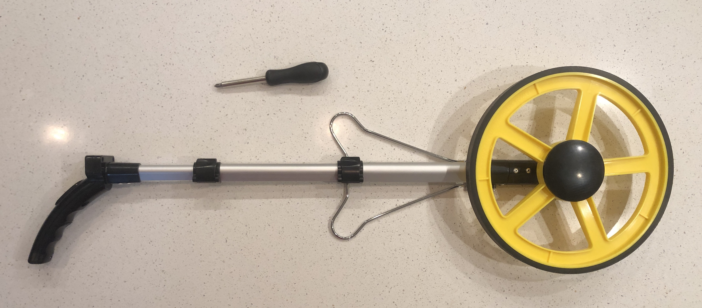
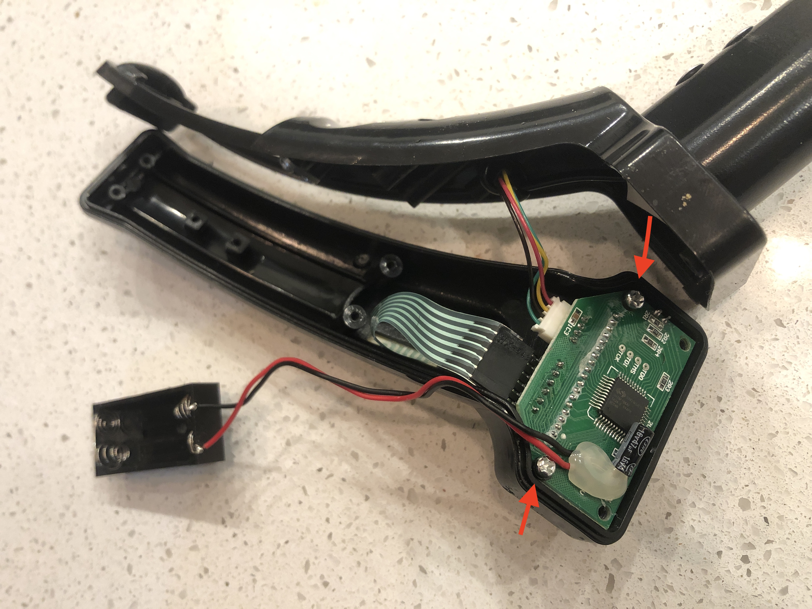
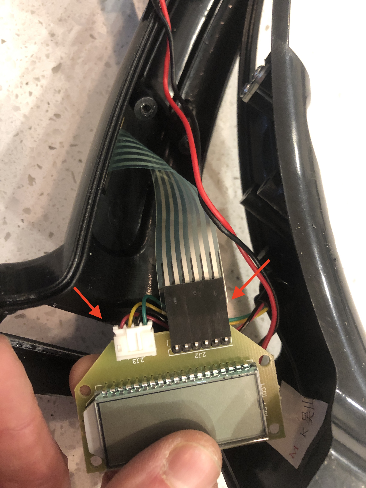
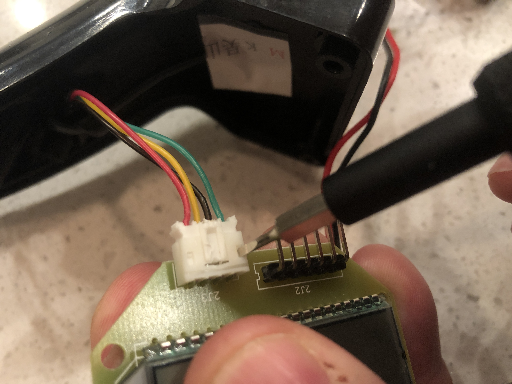
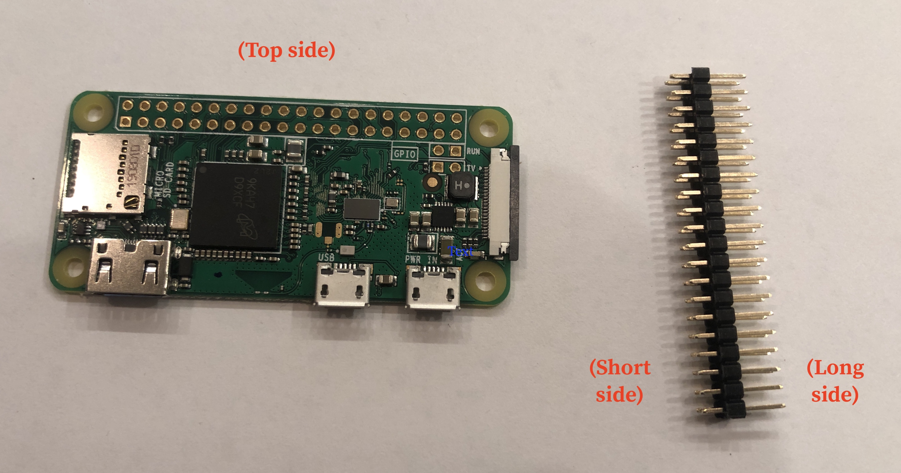
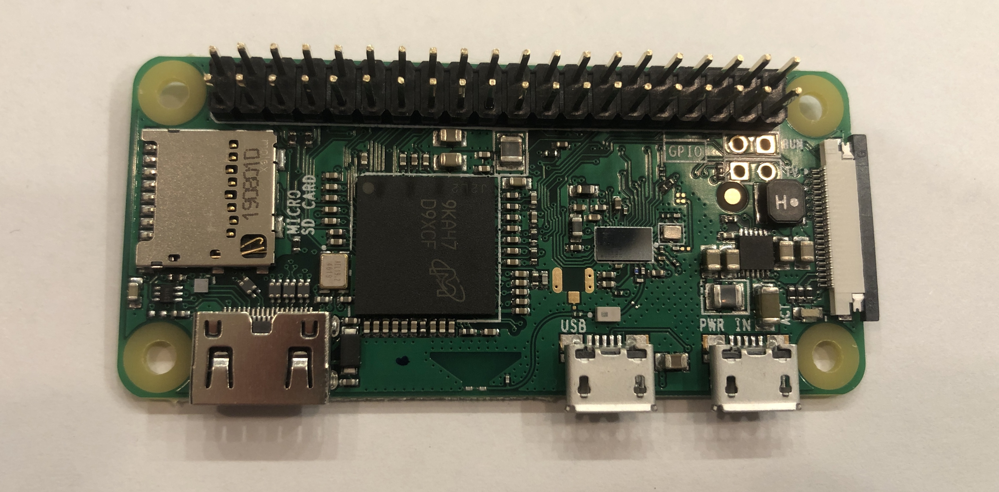
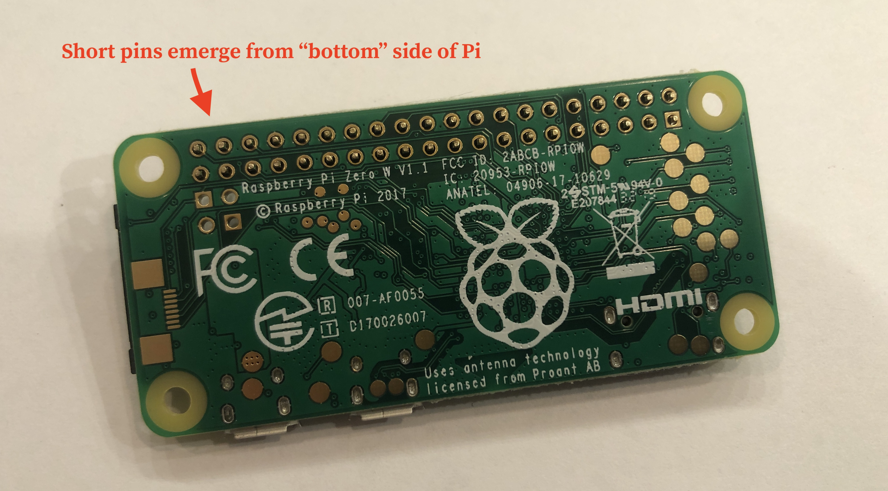
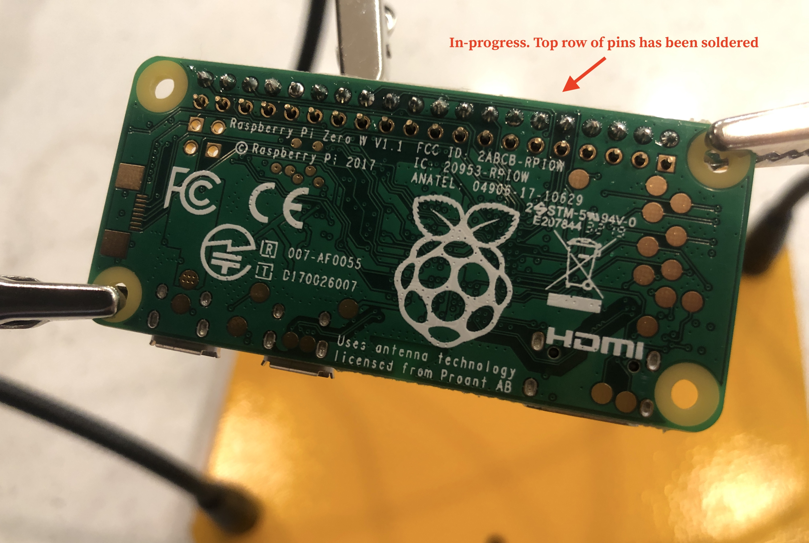

# Initial set-up

How to build a curb wheel from scratch. Covers hardware and software.

## Prep the measuring wheel

1. Take the measuring wheel out of its packaging and place it on a work surface.

2. Use a Philips-head screwdriver to remove the screws on the handle of the measuring wheel. There are 4 screws on the underside of the handle (2 of them are set deeply). Removing these will reveal the battery compartment. Remove the 2 AAA batteries. Then remove the additional 3 screws that are accessible from the battery compartment.

3. Inside the handle is a circuit board with an LCD display screen on the back. Remove the 2 screws on this circuit board.

4. The circuit board has two cables coming into it: a translucent ribbon cable with a black connector, and a JST cable that has four colored wires (red, yellow, black, green) with a white connector.

The ribbon cable carries signals from the buttons on the handle to the circuit board. We don't need this functionality. Detach the ribbon cable from the board by pulling back gently on the cable.
The JST cable carries measurement signals up from the shaft of the wheel. We will be routing these signals to the Raspberry Pi instead of the circuit board. Carefully remove the JST connector from the circuit board. This can be tricky; it helps to use a tiny screwdriver to push down on the two small tabs that look like indents on the surface of the connector. It may also help to use the screwdriver as a lever to gently force the connector out of its housing. Be very careful not to damage the connector or the wires when you do this.

The wheel should now be in pieces, like so:

5. Everything that isn't currently attached to the measuring wheel can be set aside; these parts aren't necessary. Place them in a ziploc bag or envelope for safe keeping.

## Assemble the Raspberry Pi

The Raspberry Pi includes the green circuit board itself and breakout pins (in a 2x20 orientation). The "bottom" side of the Pi is flat and has the raspberry logo on it. The "top" side of the Pi has ports and other irregularities coming out of it. The breakout pins have a short side and a long side.

1. The Pi may come with a heat exchanger (small square with prongs) to help keep the Pi cool. This has a square of sticky adhesive on the back. If you have one of these, remove the adhesive backing and stick this onto the big black square on the top of the Pi. If you don't have a heat exchanger, skip this step.
2. Place the Pi on a work surface with the top side facing up. Place the short side of the breakout pins into the 2x20 set of holes on one edge of the Pi. The long side of the breakout pins will be sticking out of the top of the Pi:

Flip the Pi and the pins over to the bottom side, keeping everything in place:

3. Solder the pins onto the bottom side of the board. (It may help to prop the pins in place, or use "helping hands" with alligator clips to hold everything together). Each individual pin needs to have a soldered connection to the gold circle around its hole. Be very careful not to solder two pins to one another or to another gold circle on the board.

4. If your Pi comes with a protective case, add the case the top and bottom of the Pi, placing the screws through the 4 corner holes to keep it in place.

## Prepare the Micro SD card

(placeholder for Morgan)

## Final wiring
