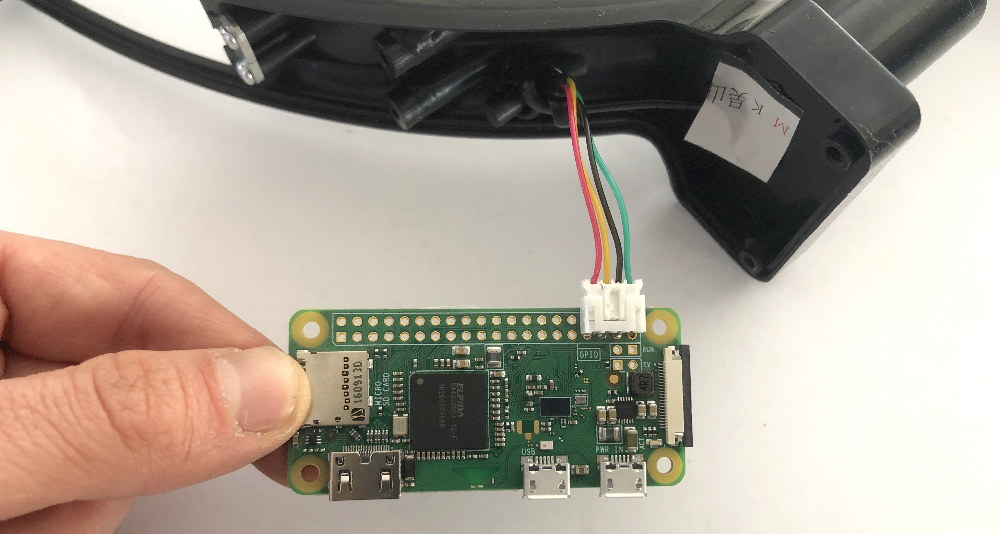

# Initial set-up

How to build a CurbWheel from scratch. Covers hardware and software.

## Prep the measuring wheel

The measuring wheel works by using a ["rotary encoder"](https://howtomechatronics.com/tutorials/arduino/rotary-encoder-works-use-arduino/), which is a set of [magnets and sensors](https://i.imgur.com/QDmhP2q.jpg) in its shaft. As the wheel turns, one of the magnets passes a sensor every 0.1 metres rolled, and a signal is sent up to the circuit board. These signals are added (when rolling forwards) and subtracted (when rolling backwards) to keep track of the distance rolled. We will be taking the wheel apart and sending these measurement signals to the Raspberry Pi instead.

1\. Take the measuring wheel out of its packaging and place it on a work surface:


2\. Use a Philips-head screwdriver to remove the screws on the handle of the measuring wheel. There are 6 screws on the underside of the handle (2 of them are set deeply). Removing these will reveal the battery compartment. Remove the 2 AAA batteries. Then remove the additional 3 screws that are accessible from the battery compartment:


3\. Inside the handle is a circuit board with an LCD display screen on the back. Remove the 2 screws on this circuit board:


4\. The circuit board has two cables coming into it: a translucent ribbon cable with a black connector, and a JST cable that has four colored wires (red, yellow, black, green) with a white connector.


The ribbon cable carries signals from the buttons on the handle to the circuit board. We don't need this functionality. Detach the ribbon cable from the board by pulling back gently on the cable.

The JST cable carries measurement signals up from the shaft of the wheel. We will be routing these signals to the Raspberry Pi instead of the circuit board. Carefully remove the JST connector from the circuit board. This can be tricky; it helps to use a tiny screwdriver to push down on the two small tabs that look like indents on the surface of the connector. It may also help to use the screwdriver as a lever to gently force the connector out of its housing. Be very careful not to damage the connector or the wires when you do this.


The wheel should now be in pieces, like so:


5\. Everything that isn't currently attached to the measuring wheel can be set aside; these parts aren't necessary. Place them in a ziploc bag or envelope for safe keeping.

## Assemble the Raspberry Pi

1\. The Raspberry Pi has a "top" and a "bottom" side. The "bottom" side of the Pi is flat and has the raspberry logo on it. The "top" side of the Pi has ports and other irregularities coming out of it. Place your Pi on a work surface with the top side facing up. Note that there is a 2x20 grid of "breakout holes" on one side of the Pi.

2\. Take the new JST cable (not the one attached to the wheel) and very gently remove the female end of the connector piece at the end of the cable:


3\. You will be positioning the female end of the JST connector so that its 4 metal pins fit into the breakout pin holes on the Pi. It is very important that you plug the connector into the correct holes. Note the alignment and positioning very carefully in the images below. Locate the correct holes and gently spread the 4 pins on the connector apart so that they will fit into the holes. This can be done manually, the pins are flexible.:


When plugged in, the connector should look like this:


4\. Flip the Pi over so that the bottom side is facing up. Triple-check to ensure you have plugged the connector into the correct holes. Solder the 4 pins from the connector cable to the bottom side of the board. Each individual pin needs to have a soldered connection to the gold circle around its hole. Be very careful not to solder two pins to one another or to another gold circle on the board.


5\. Plug the JST cable on the wheel into the JST connector that you just soldered onto the Pi. It should snap into place:




## Prepare the Micro SD card

(placeholder for Morgan)

## Load the map data for the area you are surveying

(placeholder)


-----

## run

```sh
npm start
```

## test

```sh
npm t
```

## lint

Checks for syntax errors and automatically formats code.

```sh
npm run lint
```
