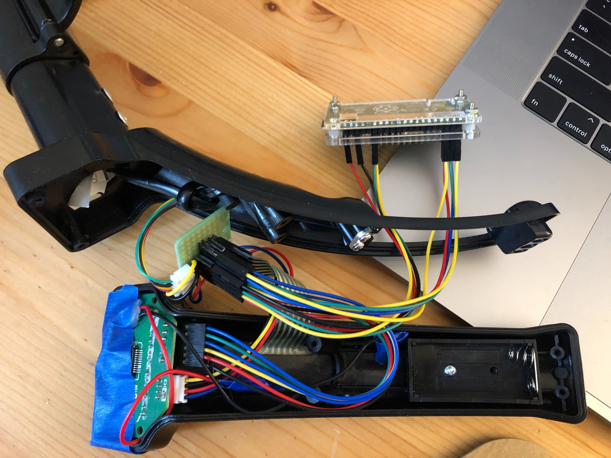
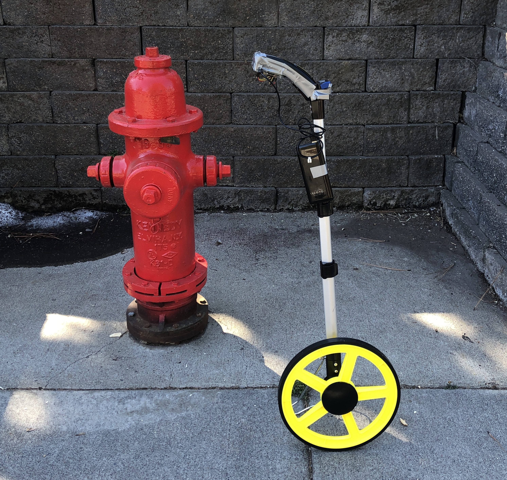

## Parity approach

Below are wiring diagrams for the curb wheel's test phase, where we send all signals to both the Raspberry Pi and the original wheel's board and display. The purpose of this is to keep parity between the board so we can tell if measurements are being miscounted.

### Parts list
In addition to the production [parts list](../PARTS.md), you will need:
- [2x20 GPIO breakout pins](https://www.sparkfun.com/products/14275) soldered on to the Pi
- A handful of [male-to-female jumper wires]
- A handful of [male-to-male jumper wires](https://www.sparkfun.com/products/11026)
- A [protoboard](https://www.sparkfun.com/products/8808)
- A strip each of [male](https://www.sparkfun.com/products/116) and [female](https://www.sparkfun.com/products/115) header pins (you will cut to size)
- (Optional) [case](https://www.adafruit.com/product/3252) for the Pi, to protect it
- (Optional) duct tape to attach the handle apparatus back together

### Wiring diagrams
All inputs are passed to the protoboard, which then redirects to both the Pi and the wheel's circuit board.

The protoboard is wired like this:

The Raspberry Pi GPIO pins are wired like this:

### Scripts

With this configuration, the wheel uses the [counter.py](https://github.com/sharedstreets/curb-wheel/blob/master/parity_wiring_and_scripts/counter.py) script to interpret the signals from the sensors and buttons. The timestamp included is a placeholder for that and other data that will come out of the API running on the Pi.

To use the script, add it onto the Pi's micro SD card, power up the Pi and connect to it. Then `ssh` into the Pi and run `python3 counter.py`.

### Outcome

The parity wiring approach is much more cumbersome:

This multitude of wires is why we're not using a parity approach for the final design of the wheel. However, there are advantages to being able to check that the Pi's measurement counter is in sync with the distance measured by the original wheel's circuit board. [Here](https://www.youtube.com/embed/uzYCI5T0EVE) you can see the measurements working in sync, with all buttons on the handle functioning.

When enclosed in its (duct-tape-enhanced) case and attached to a power bank, the parity wheel looks like this:

